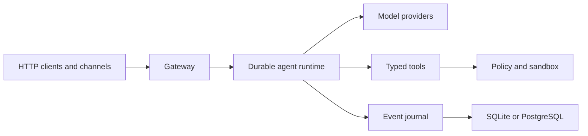

# Gofer

> A durable, Go-native agent runtime for work that should survive more than one request.

[](https://github.com/Rememorio/gofer/actions/workflows/ci.yml)
[](go.mod)
[](LICENSE)

Gofer turns language models into a stateful service: conversations have durable
runs, tools execute behind explicit boundaries, events can be replayed, and
long-running work can continue through subagents, schedules, or chat channels.
It ships as one inspectable binary with SQLite by default and PostgreSQL for
shared deployments.

Gofer is inspired by [DeerFlow](https://github.com/bytedance/deer-flow), but is
an independent implementation—not an official ByteDance project or a port of
its Python internals.

## Why Gofer

- **Durable by default.** Threads, runs, messages, tool activity, usage, and
  terminal outcomes are journaled before clients observe them.
- **Safe execution.** Typed tools, policy checks, scoped workspaces, bounded
  output, read-before-write protection, and sandbox decisions guard every
  model-requested side effect.
- **Built for long-running work.** Goals, todos, memory, context compaction,
  structured clarification, schedules, and bounded parallel subagents share
  one runtime.
- **Open extension surfaces.** Add capabilities through MCP servers, portable
  `SKILL.md` packages, browser automation, web research, or native Go adapters.
- **Available where teams already work.** Connect Slack, Telegram, Discord,
  Feishu/Lark, DingTalk, WeCom, WeChat, GitHub, Buzz/Nostr, or a signed webhook.
- **Operationally small.** The gateway, runtime, persistence, scheduler,
  channels, metrics, and CLI are delivered in a single Go binary.

## Quick start

You need Go 1.26 or newer and an OpenAI-compatible API key.

```sh
git clone https://github.com/Rememorio/gofer.git
cd gofer
cp config.example.yaml config.yaml
export OPENAI_API_KEY=your-key
go run . serve --config config.yaml
```

The default configuration listens on `127.0.0.1:8001`, stores durable state
under `.gofer/`, and keeps host command execution disabled.

Check the service and run a first task:

```sh
curl -sS http://127.0.0.1:8001/healthz

curl -sS -X POST http://127.0.0.1:8001/api/runs/wait \
  -H 'content-type: application/json' \
  -d '{
    "assistant_id": "primary",
    "input": {
      "messages": [
        {"role": "user", "content": "Write a short Go concurrency checklist."}
      ]
    }
  }'
```

See [Getting started](docs/getting-started.md) for Docker, Anthropic, durable
threads, streaming, and the first production settings to change.

## What is included

| Area | Included capabilities |
| --- | --- |
| Runtime | Streaming model/tool loop, cancellation, replay, context compaction, terminal recovery |
| Coordination | Goals, todos, memory, structured human input, schedules, parallel subagents |
| Tools | Scoped files and artifacts, shell sandbox, browser, web research, MCP, skills |
| Models | OpenAI-compatible Chat Completions and native Anthropic Messages |
| Persistence | In-memory development store, SQLite, PostgreSQL, resumable SSE |
| Platform | Bearer RBAC, Prometheus metrics, uploads, feedback, token usage, workspace review |
| Channels | Slack, Telegram, Discord, Feishu/Lark, DingTalk, WeCom, WeChat, GitHub, Buzz/Nostr, webhook |

## How it fits together



The runtime owns the state machine; HTTP, databases, model SDKs, sandboxes, and
channel providers are adapters around it. This keeps replay deterministic and
prevents an integration SDK from defining the core contracts.

## Documentation

| Guide | Use it for |
| --- | --- |
| [Getting started](docs/getting-started.md) | Install, launch, and complete a first run |
| [Configuration](docs/configuration.md) | Models, storage, tools, auth, and optional services |
| [API](docs/api.md) | Threads, runs, streaming, files, memory, schedules, and resources |
| [Channels](docs/channels.md) | Messaging providers, binding codes, commands, and webhooks |
| [Deployment](docs/deployment.md) | Containers, releases, persistence, and upgrades |
| [Security model](docs/security.md) | Trust boundaries, isolation, network policy, and operations |
| [Architecture](docs/architecture.md) | Runtime layers, durable lifecycle, and contributor invariants |
| [Compatibility](docs/compatibility.md) | DeerFlow-aligned behavior and explicit non-goals |

The [documentation index](docs/README.md) is the stable entry point for all
project guides.

## Project status

Gofer is usable and continuously validated, but its public API may still evolve
before a 1.0 release. Compatibility claims are limited to behavior covered by
contract tests; see [Compatibility](docs/compatibility.md) for the reference
baseline and exclusions.

## Contributing

Bug reports and focused changes are welcome. Read [CONTRIBUTING.md](CONTRIBUTING.md)
for architecture expectations, quality gates, and commit conventions. Report
security issues privately according to [SECURITY.md](SECURITY.md).

## License

[MIT](LICENSE)
