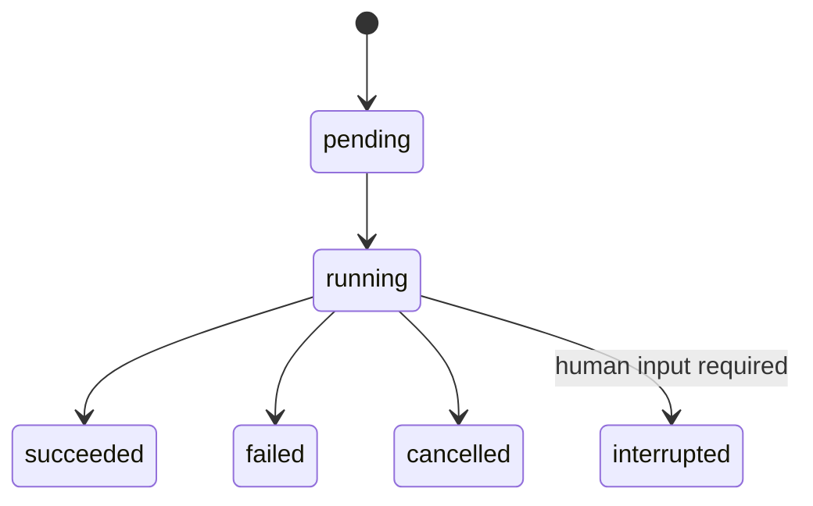

# HTTP API

Gofer exposes durable threads, runs, events, files, extensions, control state,
and operational resources below `/api`.

## Conventions

- JSON requests use `Content-Type: application/json` unless the endpoint is a
  multipart upload.
- IDs are opaque and should not be constructed by clients.
- When authentication is enabled, send `Authorization: Bearer <token>`.
- Thread-owned resources are always checked against the authenticated
  principal; client metadata cannot override ownership.
- Unknown JSON fields and malformed compatibility placeholders fail fast.
- Timestamps use RFC 3339 and durable event sequence numbers start at one.
- `/healthz` and `/metrics` are public. Bearer policy applies to API routes;
  restrict the operational endpoints at the listener, firewall, or reverse
  proxy when metrics should not be exposed.

## Run lifecycle



Every run owns one append-only event sequence. Events are persisted before
publication, so JSON history and SSE replay observe the same order.

## Threads and runs

| Method and path | Purpose |
| --- | --- |
| `POST /api/threads` | Create an owner-scoped thread |
| `GET /api/threads` | List and search threads with pagination |
| `POST /api/threads/search` | Search using a JSON request |
| `GET/PATCH/DELETE /api/threads/{thread_id}` | Read, update, or delete a terminal thread |
| `GET /api/threads/{thread_id}/state` | Materialized conversation and interrupt state |
| `GET /api/threads/{thread_id}/messages` | Durable conversation messages |
| `POST /api/threads/{thread_id}/branches` | Branch from a completed assistant turn |
| `POST /api/threads/{thread_id}/runs` | Create an asynchronous run |
| `POST /api/threads/{thread_id}/runs/wait` | Create and wait for a terminal run |
| `POST /api/threads/{thread_id}/runs/stream` | Create and stream a run with SSE |
| `GET /api/threads/{thread_id}/runs` | List thread runs |
| `GET /api/threads/{thread_id}/runs/{run_id}` | Read one run |
| `POST /api/threads/{thread_id}/runs/{run_id}/cancel` | Request cancellation |

Stateless convenience endpoints create a thread unless a compatible owned
thread is supplied in the request configuration:

```text
POST /api/runs/wait
POST /api/runs/stream
GET  /api/runs/{run_id}/messages
```

A minimal run request is:

```json
{
  "assistant_id": "primary",
  "input": {
    "messages": [
      {"role": "user", "content": "Investigate the failure."}
    ]
  },
  "context": {
    "max_tokens": 4096,
    "temperature": 0.2
  }
}
```

Inputs accept OpenAI roles plus LangChain's `human` and `ai` aliases. Text,
image blocks, assistant tool calls, and tool results are normalized before the
runtime receives them.

## Events and SSE

```text
GET  /api/threads/{thread_id}/runs/{run_id}/events
GET  /api/threads/{thread_id}/runs/{run_id}/stream
GET  /api/threads/{thread_id}/runs/{run_id}/join
POST /api/threads/{thread_id}/runs/{run_id}/stream
```

SSE `id` values are durable journal sequence numbers. Reconnect with
`Last-Event-ID` to replay later events before watching live commits. Terminal
streams drain the journal briefly so the final persisted event cannot be lost
to status/event commit ordering.

## Structured human input

The `ask_clarification` tool can interrupt a run with a choice, text request,
or bounded form. Read pending state from:

```text
GET /api/threads/{thread_id}/state
GET /api/threads/{thread_id}/human-input
```

Resume by starting a later run whose user message carries:

```json
{
  "role": "user",
  "content": "Use staging.",
  "additional_kwargs": {
    "human_input_response": {
      "request_id": "REQUEST_ID",
      "answers": {"environment": "staging"}
    }
  }
}
```

A visible plain-text response can answer the latest open request for legacy
clients. The original interrupted run remains immutable.

## Files, uploads, and artifacts

| Method and path | Purpose |
| --- | --- |
| `POST /api/threads/{thread_id}/uploads` | Upload a bounded multipart batch |
| `GET /api/threads/{thread_id}/uploads/limits` | Discover accepted limits |
| `GET /api/threads/{thread_id}/uploads/list` | List durable uploads |
| `DELETE /api/threads/{thread_id}/uploads/{filename}` | Remove one upload |
| `GET /api/threads/{thread_id}/artifacts` | List presented outputs |
| `GET /api/threads/{thread_id}/artifacts/{path...}` | Download an artifact, including ranges |

Upload names are collision-free and resolve to stable virtual paths. Optional
Office/PDF conversion creates a protected Markdown companion without replacing
the original. Artifact delivery disables MIME sniffing and forces active HTML
or SVG content to download.

Attach uploaded filenames to a user message in `additional_kwargs.files`.
Gofer validates the files on disk and supplies bounded previews to the current
model call without altering the durable user message.

## Goals, todos, and memory

```text
GET/PUT/DELETE /api/threads/{thread_id}/goal
GET            /api/threads/{thread_id}/control
PUT            /api/threads/{thread_id}/todos

GET/DELETE     /api/memory
POST           /api/memory/reload
POST           /api/memory/facts
PATCH/DELETE   /api/memory/facts/{fact_id}
GET            /api/memory/export
POST           /api/memory/import
GET            /api/memory/config
GET            /api/memory/status
```

Goal and todo changes use optimistic versions and are rejected while a run is
active. Memory operations remain scoped to the authenticated owner; imports
validate the complete batch before atomically replacing that scope.

## Models, assistants, and skills

```text
GET  /api/models
GET  /api/models/{model_name}
GET  /api/features
POST /api/assistants/search
GET  /api/assistants/{assistant_id}
GET  /api/assistants/{assistant_id}/graph
GET  /api/assistants/{assistant_id}/schemas
GET  /api/skills
GET  /api/skills/{skill_name}
POST /api/skills/{skill_name}/enable
POST /api/skills/{skill_name}/disable
POST /api/skills/reload
```

Discovery responses never include provider or extension credentials. Skill
changes are serialized, persisted when SQL is active, and projected atomically.

## Conversation helpers

```text
POST /api/input-polish
GET  /api/suggestions/config
POST /api/threads/{thread_id}/suggestions
```

Input polishing is non-persistent. Suggestions fail soft with an empty list.
Automatic first-turn titles never overwrite an explicit user rename.

## Feedback, usage, and workspace review

```text
POST/PUT/GET/DELETE /api/threads/{thread_id}/runs/{run_id}/feedback
GET                    /api/threads/{thread_id}/runs/{run_id}/feedback/stats
GET                    /api/threads/{thread_id}/token-usage
GET                    /api/threads/{thread_id}/runs/{run_id}/workspace-changes
```

Feedback is unique per thread, run, and user. Token totals are derived from
immutable provider usage events and grouped by model and caller. Workspace
reviews bound file count and diff content; secret-looking, binary, large, and
symlink paths remain metadata-only.

## Scheduled tasks

```text
GET/POST    /api/scheduled-tasks
GET/PATCH/DELETE /api/scheduled-tasks/{task_id}
POST        /api/scheduled-tasks/{task_id}/pause
POST        /api/scheduled-tasks/{task_id}/resume
POST        /api/scheduled-tasks/{task_id}/trigger
```

Tasks accept one RFC 3339 time or a five-field cron expression with an IANA
timezone. Durable leases prevent overlapping dispatch and recover expired work.

## Channels

Provider discovery, binding codes, connection listing, and disconnect endpoints
are documented with their message commands in [Channels](channels.md).

## Operational endpoints

```text
GET /healthz
GET /metrics
```

Metrics use bounded label sets and Prometheus text exposition. See
[Configuration](configuration.md) for API authentication permissions and
[Security](security.md) before making either operational endpoint public.
