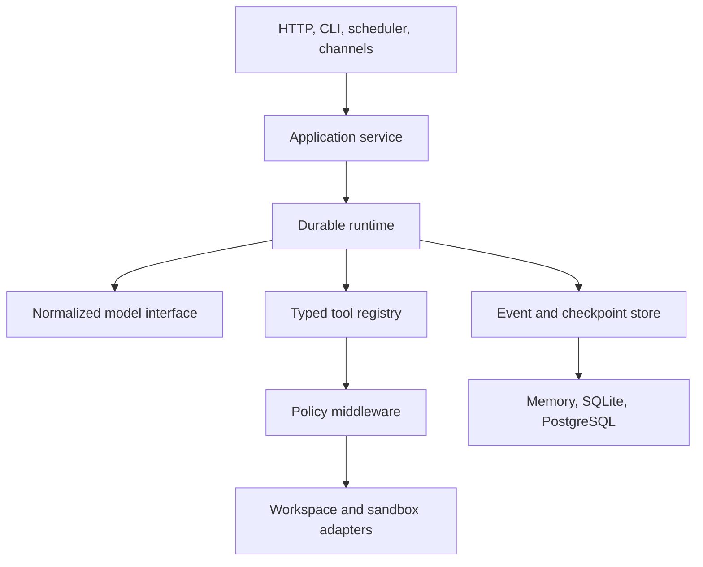

# Architecture

Gofer is a durable state machine with adapters around it. The core runtime does
not depend on HTTP, database drivers, model SDKs, sandbox implementations, or
channel providers.

## Design principles

### Durable before observable

A run persists typed events before publishing them to SSE consumers. Live
notifications are wake hints; clients always read ordered storage. This makes
reconnect, replay, and multi-instance polling share one contract.

### Interfaces at consumer boundaries

The runtime owns the interfaces it consumes. Provider SDK types are normalized
at adapter boundaries, database behavior implements the store contract, and
tools expose typed definitions rather than leaking implementation objects.

### Side effects are explicit

Model output cannot mutate the host directly. A side effect must become a
validated tool call, pass policy middleware, resolve inside the thread scope,
and receive a sandbox decision before execution.

### One owner per goroutine

Every background worker, channel source, browser session, scheduler loop, and
subagent has a parent context, bounded work, and a shutdown path.

## Core layers

| Layer | Primary packages | Responsibility |
| --- | --- | --- |
| Domain | `internal/domain`, `internal/event` | IDs, messages, runs, typed immutable events |
| Runtime | `internal/runtime`, `internal/conversation`, `internal/contextwindow` | Model/tool loop, history, compaction, cancellation, terminal outcome |
| Coordination | `internal/control`, `internal/subagent`, `internal/memory`, `internal/humaninput` | Goals, todos, delegation, memory, clarification |
| Tools | `internal/tool`, `internal/tool/builtin`, `internal/mcp`, `internal/skill` | Definitions, validation, built-ins, and extensions |
| Safety | `internal/policy`, `internal/guardrail`, `internal/readbeforewrite`, `internal/loopdetect` | Authorization, untrusted-content handling, mutation and loop bounds |
| Execution | `internal/workspace`, `internal/sandbox`, `internal/browser`, `internal/webresearch` | Files, commands, browser sessions, and network retrieval |
| Persistence | `internal/store`, `internal/store/sqlstore` | In-memory reference state and SQL durability |
| Transports | `internal/gateway`, `internal/channel`, `internal/app` | HTTP/SSE, chat providers, scheduling, and service assembly |
| Providers | `internal/model/*` | OpenAI-compatible and Anthropic normalization |

`main.go` only owns process signals and CLI dispatch. `internal/cli` parses
commands, while `internal/app` assembles concrete adapters.

## Durable run lifecycle

1. The gateway validates a launch request and persists a pending run plus its
   first event.
2. The application reconstructs durable conversation history and selects a
   configured model alias.
3. Runtime middleware prepares bounded context and invokes the normalized model
   stream.
4. Assistant deltas become a response or typed tool calls.
5. Tool calls pass schema validation, policy, workspace, concurrency, and
   sandbox gates before execution.
6. Tool results and model usage are journaled, then the loop continues within
   configured turn and token limits.
7. Outstanding child work is drained, workspace changes and delivery receipts
   are persisted, and exactly one terminal state is committed.
8. JSON and SSE clients observe the same journal and may replay it after a
   disconnect.

## Persistence model

The durable store owns threads, runs, checkpoints, and ordered events. Feature
stores for memory, feedback, controls, schedules, skills, and channel state use
the same SQL connection when available.

SQLite is a pure-Go, single-process default. PostgreSQL uses pgx and supports
shared deployments. The in-memory adapter implements the same semantics for
deterministic tests and disposable runs.

Thread files are intentionally separate from the database. Each thread owns a
bounded workspace with upload, working, output, and internal directories.
Database and workspace backups must therefore be coordinated.

## Runtime safeguards

Middleware ordering is part of the runtime contract:

- untrusted user and remote content is framed before model calls;
- tool history is repaired only in provider-facing context, never in storage;
- existing files require a current read revision before mutation;
- same-path writes are serialized across lead and child agents;
- repeated tool patterns and per-tool frequency have warning and hard limits;
- oversized tool results are externalized before entering later model context;
- unsafe length- or safety-capped tool intent is removed before execution;
- a tool-using run ends with visible assistant text or an explicit failure.

See [Security](security.md) for deployment-facing trust boundaries.

## Architectural invariants

1. A run has one ordered event sequence and one terminal outcome.
2. Persisted events precede external publication.
3. Cancellation reaches models, tools, sandboxes, browsers, and subagents.
4. Model, provider, repository, skill, MCP, upload, and channel data is
   untrusted until validated at the appropriate boundary.
5. Public side effects require authorization before execution begins.
6. Thread state, files, memory, and channels never cross an authenticated owner
   boundary.
7. Provider SDK types never cross the normalized model interface.
8. Existing-file mutations consume a matching current read revision.
9. Length- or safety-capped tool intent never executes.
10. Every goroutine and external resource has an owner and cleanup strategy.

## Adding a capability

Prefer a concrete implementation until a real consumer boundary needs an
interface. Normalize external data immediately, keep persistence and transport
concerns outside the runtime, and add contract tests for cancellation,
malformed input, replay, and cleanup.

See [CONTRIBUTING.md](../CONTRIBUTING.md) for required quality gates.
